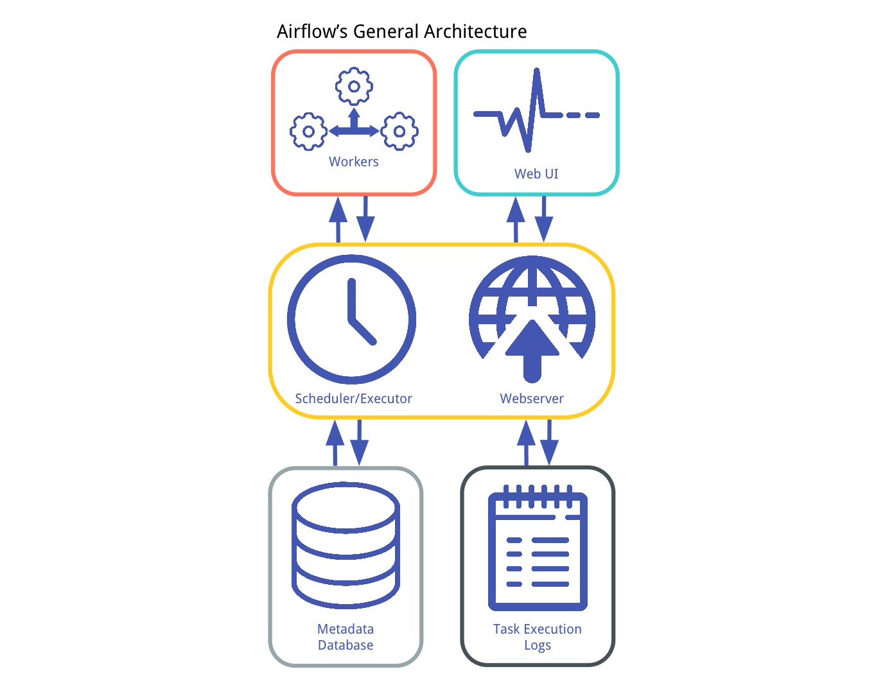

#  **Core Airflow Components** 

Airflow is a workflow orchestrator mostly used to build, develop and deploy data pipelines and ML pipelines, it has some core components that work together, these components are the followings:

Some important notes are the followings:
- Airflow is an orchestrator, not a processing framework, process your gigabytes of data outside of Airflow (i.e. You have a Spark cluster, you use an operator to execute a Spark job, the data is processed in Spark).

- A DAG is a data pipeline, an Operator is a task.

- An Executor defines how your tasks are execute whereas a worker is a process executing your task

- The scheduler schedules your tasks, the web server serves the UI, the database stores the metadata of Airflow.

- airflow db init is the first command to execute to initialise Airflow

To know more about Airflow refer to [Airflow Documentation](https://airflow.apache.org/docs/).
